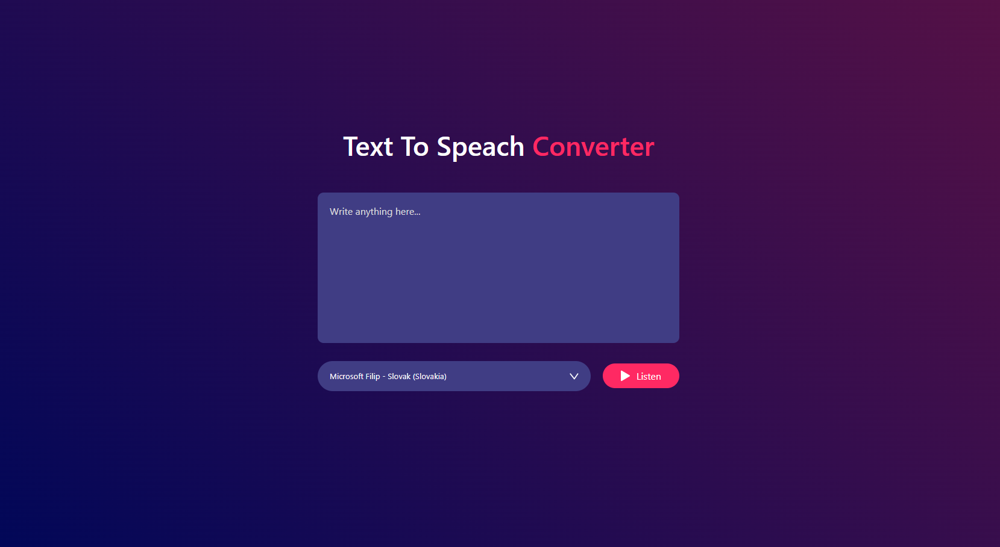

# Speech Converter

Welcome to the Speech Converter application! This simple tool allows you to narrate written text based on the language you choose. The application is ideal for those who need to convert text to speech and want the option to select their preferred language.

## Features

- **Language Selection**: Choose the language in which you want the text to be narrated.
- **Text-to-Speech Conversion**: Enter text, and the application will convert it to speech in the selected language.

## Technologies Used

- **HTML**: For the structure and content of the application.
- **CSS**: For the design and styling of the application.
- **JavaScript**: For implementing the text-to-speech conversion logic and user interface interaction.

## Getting Started

To get started with the Speech Converter, simply clone this repository and open `index.html` in your browser. You will be able to immediately start entering text and selecting a language for conversion.

## Screenshot

