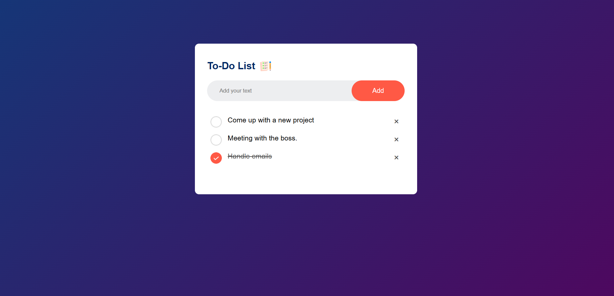

# To-Do List Application

This simple app allows you to jot down tasks that you need to accomplish throughout the day. You can easily add notes using the "Add" button, and once you've completed a task, you can check it off your list. If you want to delete a task, simply use the icon with a cross.

## Features

- **Add Tasks**: Quickly create new tasks to keep track of your daily responsibilities.
- **Check Off Completed Tasks**: Mark tasks as complete by checking them off the list.
- **Delete Tasks**: Remove any task you no longer need by clicking the cross icon.

## Technologies Used

## Getting Started

To get started with the To-Do List application, simply clone this repository and open `index.html` in your browser. You will be able to start adding tasks and managing your to-do list immediately.

## Screenshot

