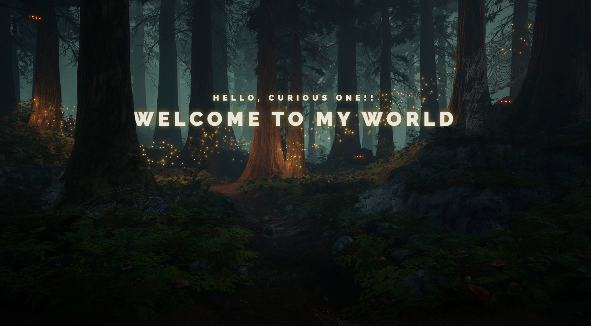
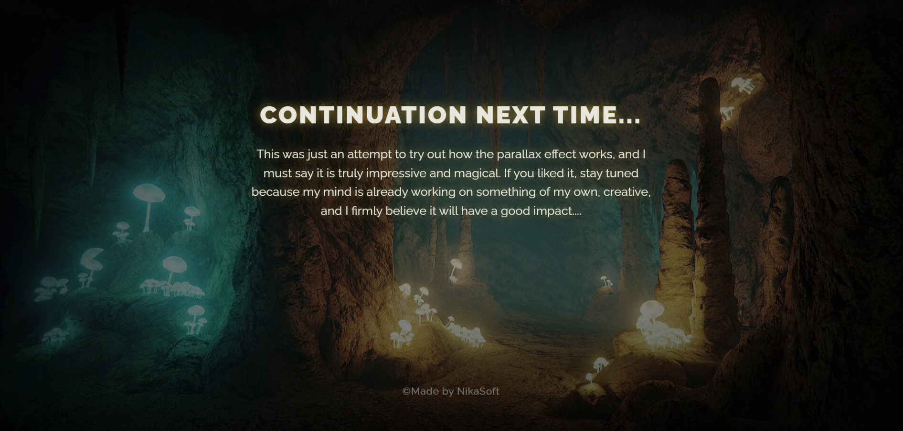

# Fairy Parallax

## Description

**Fairy Parallax** is a project that demonstrates the parallax effect, allowing the page to move beautifully in sync with mouse movement. This effect creates a dynamic and immersive experience for users, making the page more attractive and interactive. As you move the mouse, the background of the page shifts, creating the illusion of three-dimensional space. Try moving the mouse around the screen and observe how the different layers move.

## Features

- **Parallax Effect**: The page responds to mouse movements, creating a sense of depth and motion.
- **Fairy-Tale Environment**: The setting is placed in a magical forest, adding a fairy-tale and dreamy touch to the project.

## Technologies used

## Instructions to run
1. Clone this repository
2. Open the index.html file in your browser
3. Interact with the page: Move your mouse around the screen to experience the parallax effect as the background shifts, creating a three-dimensional illusion.

## Screenshot

