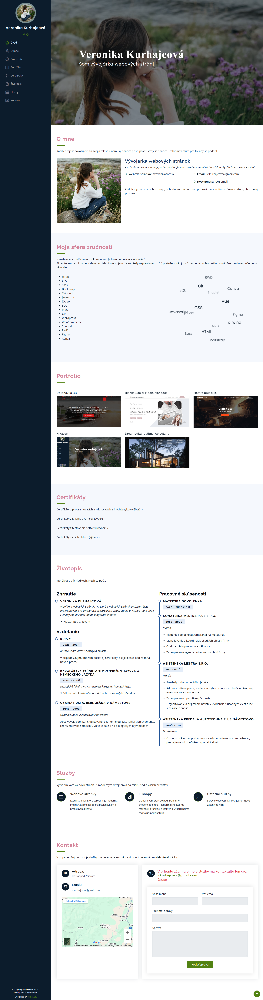

# My Portfolio

This site serves as my online resume and showcases my skills, experience, and selected projects in web development.

## About Me

Hi! I'm Veronika, a passionate web developer with a focus on building responsive, user-friendly websites. I have experience in front-end development and a keen eye for design and detail. I love exploring new technologies and continuously learning to improve my skills.

## Technologies Used

This portfolio is built using the following technologies:

- **HTML** - For the structure of the website.
- **CSS** - For styling and layout.
- **Bootstrap** - For responsive design and quick prototyping.
- **JavaScript** - For interactivity and functionality.
- **jQuery** - For easier DOM manipulation and animations.

## Instructions for Running
1. Clone the repository or download the files directly from GitHub.  
2. Open the index.html file in your browser.

## Screenshot

