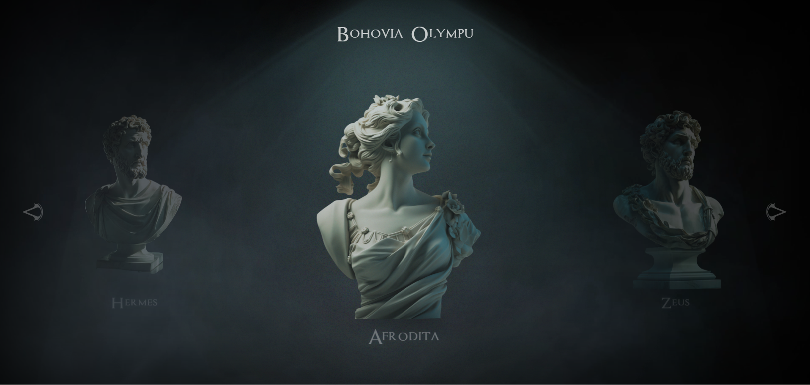

# Project Simulation of Movement from Static Images
This project is focused on creating a simulation of movement using static images. I utilized HTML, CSS, and JavaScript to achieve the effect of "moving" images that create the impression of animation or movement. The project was designed to bring static images to life through simple animations.

## Technologies Used
 - **HTML:** For structuring the content of the page 
 - **CSS:** For styling and adding basic animations and transformations 
 - **JavaScript:** For creating interactions and controlling the simulation of movement

## Project Goal
The goal of the project is to create a more dynamic visual experience using simple animation techniques that give the impression of movement from static images.

## How It Works
The project utilizes:
 - **CSS transformations and animations** to achieve movement effects
 - **JavaScript** to control and synchronize the movement of individual elements, resulting in a more realistic impression of motion.

## Instructions for Running
1. Clone the repository or download the files directly from GitHub.  
2. Open the index.html file in your browser.  
3. For full functionality, ensure that all linked CSS and JavaScript files are available.

## Screenshot

   
