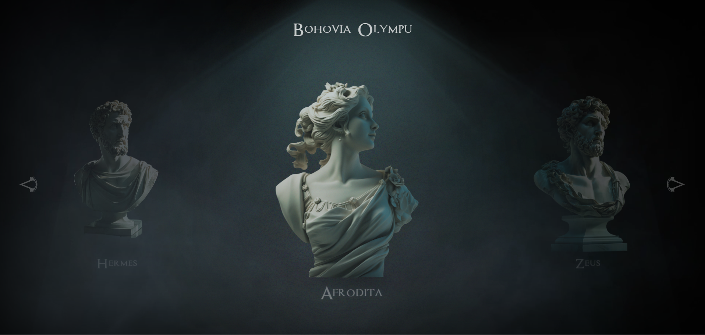

# Project Simulation of Movement from Static Images
This project is focused on creating a simulation of movement using static images. I utilized HTML, CSS, and JavaScript to achieve the effect of "moving" images that create the impression of animation or movement. The project was designed to bring static images to life through simple animations.

## Technologies Used

## Project Goal
The goal of the project is to create a more dynamic visual experience using simple animation techniques that give the impression of movement from static images.

## Instructions for Running
1. Clone the repository or download the files directly from GitHub.  
2. Open the index.html file in your browser.  
3. For full functionality, ensure that all linked CSS and JavaScript files are available.

## Screenshot

