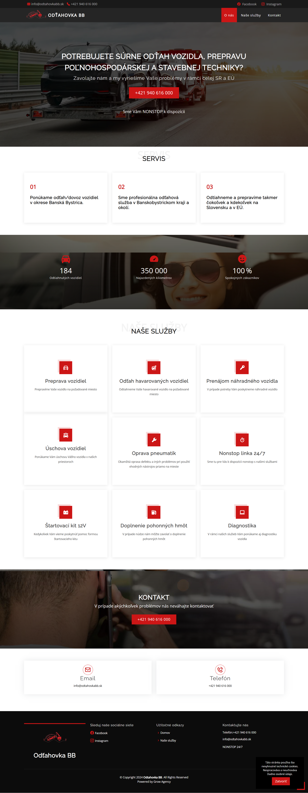

# Towing Service - Presentation Page

## Description
This project is a simple presentation page for a company that specializes in vehicle towing. Our service covers not only Slovakia but also the entire European Union. The page is designed to provide information about our services, contact details, and other relevant information for potential customers. The color scheme was the client's; my role was the design and overall layout of the page, as the client wanted it to be very simple and clear.

## Features
- Overview of towing services
- Contact information
- Simple and modern design
- Responsive layout for mobile devices

## Technologies

## Instructions for Running
1. Clone the repository or download the files directly from GitHub.  
2. Open the index.html file in your browser.

## Screenshot

